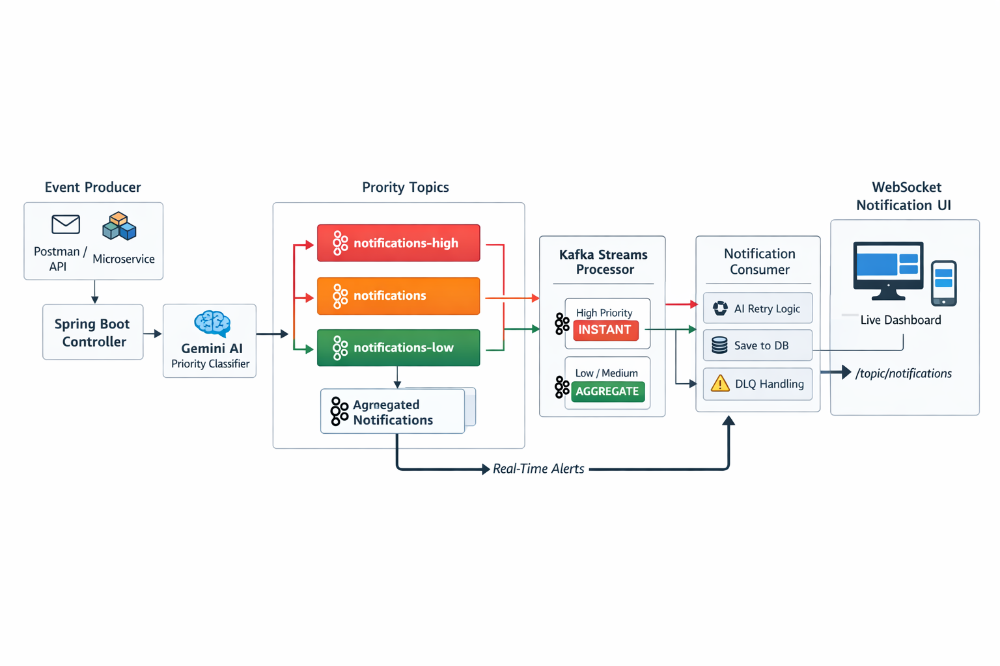

# 🚀 NotifyX — AI-Powered Real-Time Notification System

> A **production-grade, AI-driven event system** built using **Spring Boot, Kafka, Kafka Streams, Gemini AI, and WebSockets**.

---

## 🔥 Overview

NotifyX is an **intelligent notification system** that delivers real-time updates with:

* ⚡ Ultra-low latency (Kafka + WebSockets)
* 🧠 AI-based decision making (Gemini API)
* 🔁 Fault-tolerant processing (Retry + DLQ)
* 📊 Stream-based aggregation (Kafka Streams)

---

## 🧱 Tech Stack

| Layer      | Technology                  |
| ---------- | --------------------------- |
| Backend    | Spring Boot 3               |
| Messaging  | Apache Kafka                |
| Streaming  | Kafka Streams               |
| AI Engine  | Gemini API                  |
| Realtime   | WebSockets (STOMP + SockJS) |
| Database   | PostgreSQL                  |
| Frontend   | HTML + JavaScript           |
| Build Tool | Maven                       |

---

# 🏗️ Architecture Diagram




---

## ⚡ Features

### 🤖 AI Intelligence

* Smart priority classification (HIGH / MEDIUM / LOW)
* AI-based retry decision (RETRY / DROP)
* Intelligent event routing

---

### 🚀 Backend

* Kafka event-driven architecture
* Multi-topic routing
* Retry + DLQ mechanism
* PostgreSQL persistence

---

### 🌊 Kafka Streams

* Real-time aggregation (window-based)
* Priority-based routing
* High-priority instant delivery

---

### 🔴 Frontend UI

* Live notifications via WebSockets
* AI priority badges
* Sound alerts 🔊
* Auto-expiring notifications
* User filtering

---


# 🌐 API

### Send Event

```http
POST /api/events
```

### Body

```json
{
  "userId": "user123",
  "type": "payment",
  "message": "Payment failed due to insufficient balance"
}
```

> ⚠️ Priority is automatically handled by AI

---

### Get Notifications

```http
GET /api/notifications/{userId}
```

---

## ⚡ WebSocket

```
/ws
```

Subscribe:

```
/topic/notifications
```

---

## 🚀 Getting Started

### Prerequisites

* Kafka + Zookeeper
* PostgreSQL
* Java 17+

---

### Run

```bash
mvn spring-boot:run
```

---

### Open UI

```
http://localhost:8080/index.html
```

---

## 🧪 Sample Events

### 🔴 High Priority

```json
{
  "userId": "user1",
  "type": "payment",
  "message": "Payment failed due to insufficient balance"
}
```

---

### 🟢 Low Priority

```json
{
  "userId": "user1",
  "type": "promo",
  "message": "Big discount available!"
}
```

---

## 🧠 Use Cases

* Banking alerts
* Fraud detection
* E-commerce updates
* Monitoring systems
* Social notifications

---

## 👨‍💻 Author

**Akash Adak**
Backend • DevOps • Distributed Systems

---

<p align="center">⭐ Star this repo if you like it!</p>
